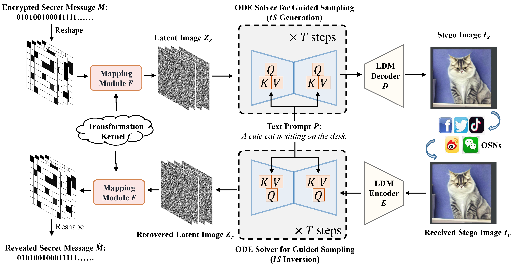

# mas_GRDH
Official implementation of "Establishing Robust Generative Image Steganography via Popular Stable Diffusion" by Xiaoxiao Hu, Sheng Li, Qichao Ying, Wanli Peng, Xinpeng Zhang and Zhenxing Qian.

Paper Link: https://ieeexplore.ieee.org/abstract/document/10637346


## Download Weights
This repository is developed based on https://github.com/Stability-AI/stablediffusion/tree/main, and we have not modified the original model architectures and weights.

The two models used in our paper:
+ Stable Diffusion v1-5: https://drive.google.com/file/d/1ISeumzN-JrhyAacOPlh1IjAv6MKffogU/view?usp=sharing
+ CLIP text encoder: https://huggingface.co/openai/clip-vit-large-patch14/tree/main

## Run Test Scripts
### Step 1: Modify the config file `configs/stable-diffusion/ldm.yaml`
> Line 72: 
> 
> version: /weight/path/to/clip

Change the path on line 72 to the local path of CLIP.

### Step 2: Run
> cd scripts
> 
> python txt2img.py --ckpt /weight/path/to/stable/diffusion/xxx.ckpt --config ../configs/stable-diffusion/ldm.yaml --dpm_steps 20 --dpm_order 2 --scale 5. --test_prompts /path/to/test_prompt_file/test_prompts.txt --attack_layer storage --attack_factor 0.01 --mapping_func ours_mapping

For example, you can test the accuracy of secret message extraction after PNG storage under different prompts: (The prompts are taken from test_prompts.txt).
> cd scripts
> 
> python txt2img.py --ckpt /data/xxhu/saved_weights/origin/SD1-5/v1-5-pruned.ckpt --config ../configs/stable-diffusion/ldm.yaml --dpm_steps 20 --dpm_order 2 --scale 5. --test_prompts ./test_prompts.txt --attack_layer storage --attack_factor 0.01 --mapping_func ours_mapping

The currently supported attack scenarios are as follows:

|Attack Scenario|attack_layer|attack_factor|
|-------|-------|-------|
|Lossless|identity|-|
|PNG|storage|-|
|Resize|resize|0.5, 0.75, 1.25, 1.5|
|JPEG Compression|jpeg|90, 70, 50|
|Median Blur|mblur|3, 5, 7|
|Gaussian Blur|gblur|3, 5, 7|
|Gaussian Noise|awgn|0.01, 0.05, 0.1|

When the attack layer is mblur or gblur, the "factor" refers to the size of the kernel, where a factor of 3 corresponds to a 3x3 kernel.

## Notes
There are some dead codes, such as those related to image resolution, etc. If you intend to use a different generative model, please make sure to modify the relevant parts accordingly.

## Citation
If you find our work helpful, we would appreciate it if you could cite the following reference:
```latex
@ARTICLE{huGRDH2024,
  author={Hu, Xiaoxiao and Li, Sheng and Ying, Qichao and Peng, Wanli and Zhang, Xinpeng and Qian, Zhenxing},
  journal={IEEE Transactions on Information Forensics and Security}, 
  title={Establishing Robust Generative Image Steganography via Popular Stable Diffusion}, 
  year={2024},
  volume={19},
  number={},
  pages={8094-8108},
  keywords={Steganography;Diffusion models;Security;Image synthesis;Accuracy;Image coding;Training;Steganography;robust steganography;generative image steganography;diffusion model},
  doi={10.1109/TIFS.2024.3444311}
  }
```